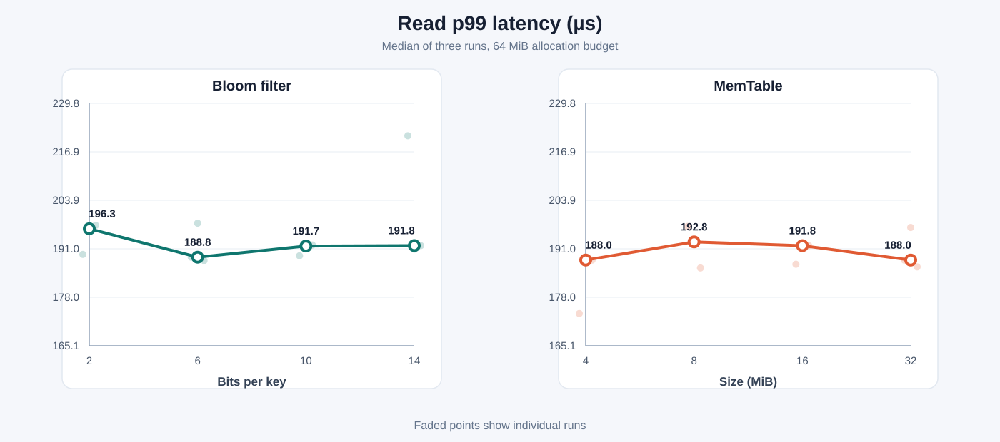
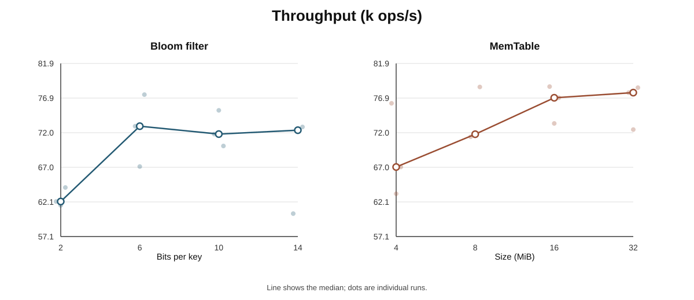
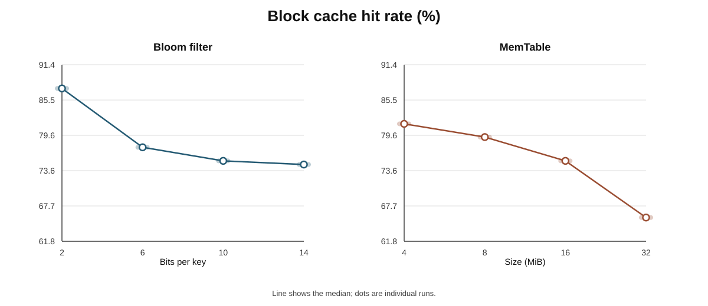

# Experiments

I use `lsmkv_bench` to run repeatable workloads against the same engine exposed by the public API. The raw runs and scripts are in [`bench/`](bench/).

## Dividing a 64 MiB allocation budget

This experiment sets a 64 MiB accounted budget across the MemTable flush threshold, Bloom bit arrays, and block cache capacity. Process RSS, container metadata and the kernel page cache are outside this accounting. The run uses 500,000 preloaded keys with values of 256 bytes, 50,000 warmup operations, and 500,000 measured operations. The workload is 95% reads, 4% writes and 1% deletes with a Zipfian distribution (`theta = 0.99`), `kSyncOff`, and three runs per configuration.

Every run starts with a fresh DB and the same seed (`42`). After preload, the harness empties the shared block cache and uses `POSIX_FADV_DONTNEED` to ask the kernel to drop SSTable pages before warmup. Warmup then builds each configuration's cache state from the same operation sequence.

The latency plots show p99 calculated with the nearest rank method. Throughput divides the measured operation count by the time spent inside the timed DB calls; workload generation and the final flush are outside that timer. Cache hit rate counts block cache lookups triggered by measured reads, so MemTable hits and queries rejected by a Bloom filter never enter its denominator.







What matters here is the tradeoff created by the 64 MiB cap. The Bloom filter, MemTable and block cache share the same pool, so giving more memory to either of the first two leaves less room for cached data blocks.

A small Bloom filter produces enough false positives to send many absent keys into the SSTable read path. Giving it more bits removes most of that wasted I/O, but the benefit soon flattens while the block cache keeps getting smaller. A larger MemTable has a similar tension. It batches more keys into each flush, which means fewer SSTables and less compaction I/O, then its throughput benefit levels off as cache pressure grows. The p99 and throughput curves are both showing these two effects pulling against each other.

The cache hit graph has one trap. A stronger Bloom filter stops many negative reads before they ask the cache, so the remaining lookup stream is harder. Its hit rate can fall because the cache is smaller and because those easy negative lookups disappeared. I read it alongside p99 and throughput instead of treating hit rate alone as the answer.

The raw runs are in [`bench/memory.csv`](bench/memory.csv). To rerun the experiment or redraw the figures:

```bash
python3 bench/memory.py
python3 bench/memory.py --plot-only
```

## Process crash test

To exercise recovery without a normal shutdown, I ran `lsmkv_crash_fuzz` for 100 iterations with seed `42`. Each iteration forks a writer and waits until it has opened the DB. The parent then waits between 10 and 100 ms, sends `SIGKILL`, waits for the child to exit, and opens the same DB again. A 1 KiB MemTable and an L0 trigger of two make these short runs reach WAL rotation, flush, Manifest updates and compaction.

The writer appends each successful operation ID to a separate oracle file and calls `fsync` before starting the next write. After recovery, every operation in that file must return the exact value through `get()`. The full iterator is checked for order and contents as well. The DB may contain one extra operation if its `put()` finished just before the process died and its oracle record had not finished yet.

```bash
./build/lsmkv_crash_fuzz --iterations 100 --seed 42
```

One local run completed all 100 iterations and verified 619 acknowledged operations. The exact operation count changes with scheduling and storage speed. The check that matters is that every recorded operation survived and all 100 DBs reopened successfully.

This test kills one process while Linux and the page cache stay alive. It covers process crash recovery. A machine power loss needs a separate test.
