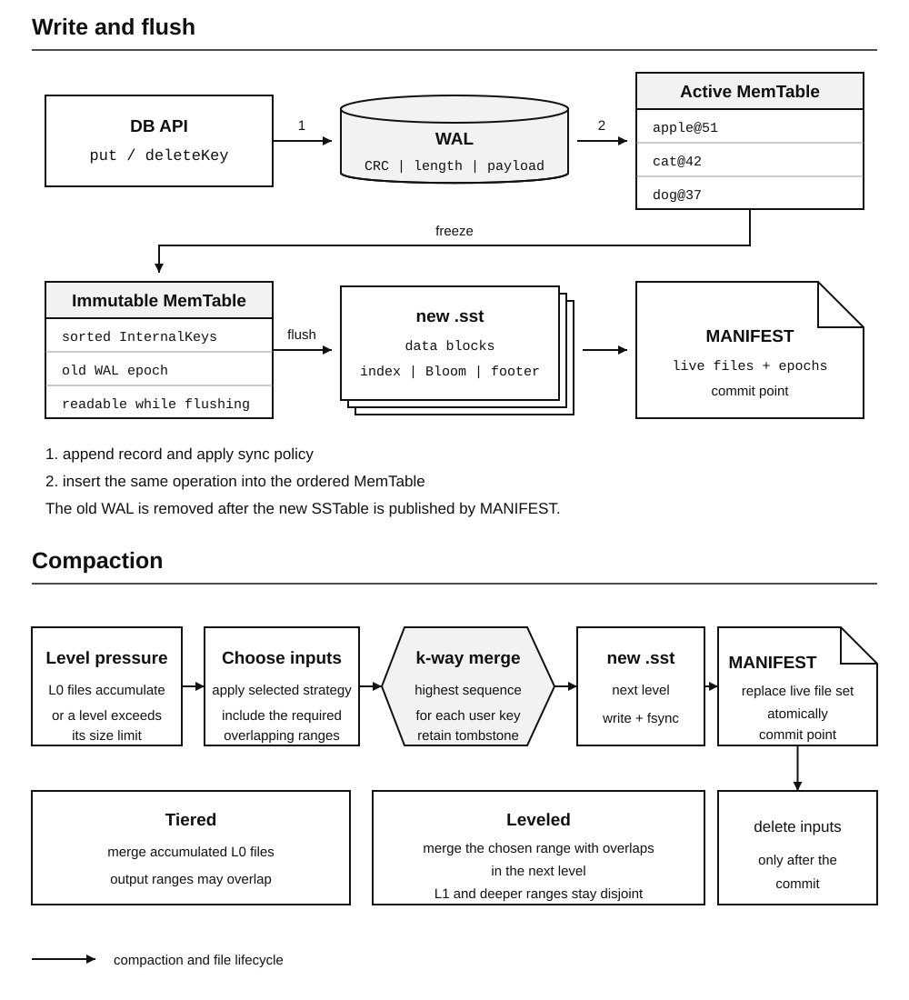
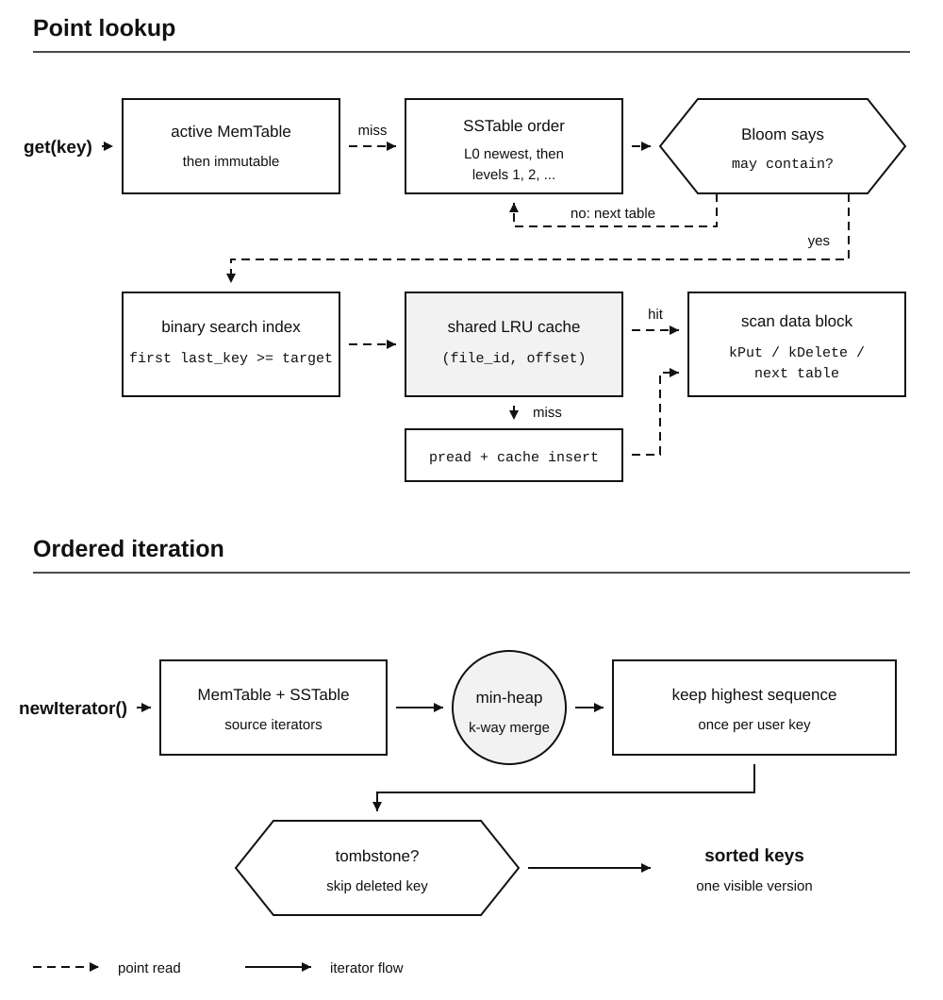
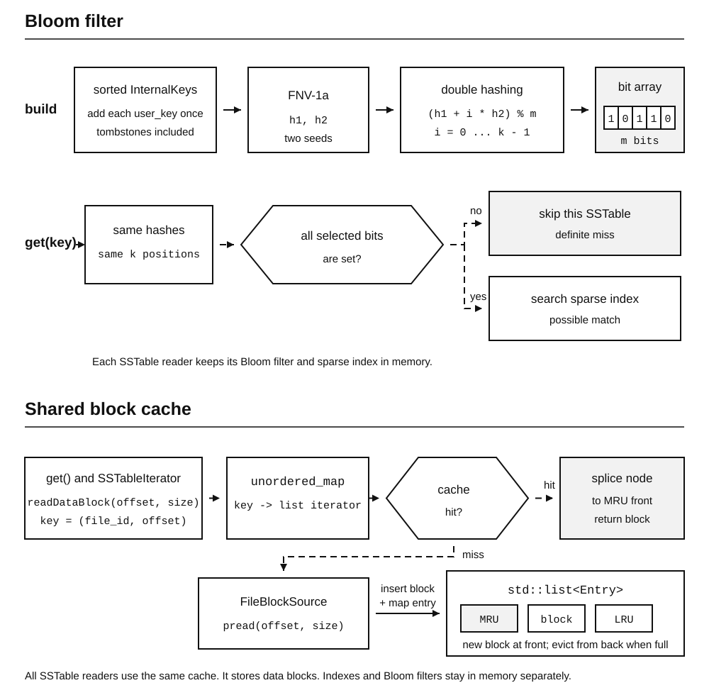
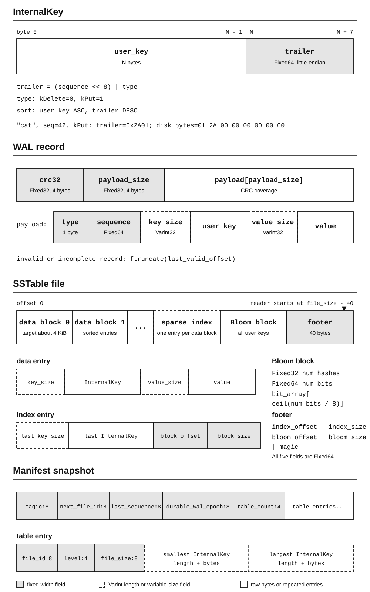
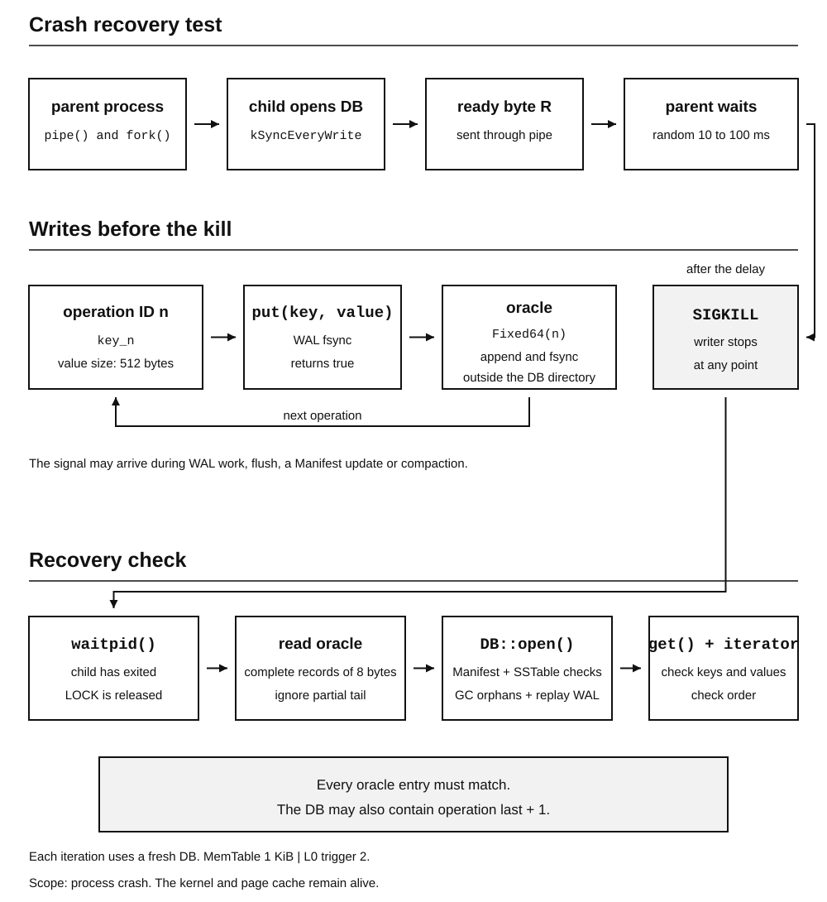

# lsmkv

I built `lsmkv` to understand a storage engine below its API. I wanted to follow a write from its log record, through an ordered table in memory, into immutable files, then recover the correct version after a crash. That meant working directly with partial writes, CRCs, file descriptors, `fsync`/`rename` ordering, and the read/write costs of an LSM tree.

`lsmkv` is an embedded storage engine for key/value pairs, written in C++20 and designed for one process. Its public API provides point reads, writes, deletes and full ordered iteration. The storage path includes WAL recovery, MemTable flush, immutable SSTables, a Manifest, synchronous compaction from L0 to L1, a Bloom filter for each SSTable and a shared LRU block cache. It runs on Linux, holds a nonblocking exclusive `flock` on `<db>/LOCK` for the lifetime of each open instance, and performs flush and compaction in the caller's thread.

## How it works

[](figures/architecture.svg)

### WAL and MemTable

A write lives in both places before it reaches an SSTable, for two different jobs. The WAL records each operation by appending it to a log. The MemTable holds the same operations in sorted order, which makes point reads cheap and gives the SSTable writer an already sorted input. On restart, valid WAL records rebuild the MemTable.

`put()` assigns a sequence number, appends the encoded operation to the WAL, applies the selected sync policy, and then inserts it into the active MemTable. When the size threshold is reached, the DB creates the next WAL before freezing the old MemTable. The frozen table remains readable until its SSTable has been written and committed through the Manifest.

With the default `kSyncEveryWrite` mode, `put()` returns success only after the WAL `fsync` completes. `kSyncEveryN` syncs after each group of N appends, leaving up to N - 1 later records unsynced. `kSyncOff` does not automatically issue a WAL `fsync`; a completed `write()` may still live only in the kernel page cache.

### SSTables and reads

[](figures/read-path.svg)

An SSTable is written sequentially and never edited in place. New values and deletions stay alongside older versions in other files. A point lookup searches in this order:

```text
active MemTable
    -> immutable MemTable
    -> Level 0 SSTables, newest file_id first
    -> Level 1 SSTables, newest file_id first
```

Each `SSTableReader` loads its sparse index and Bloom filter when it opens. A point lookup uses the Bloom filter to skip files, searches the index with binary search for one candidate block, asks the shared cache, and then scans that block linearly.

[](figures/read-structures.svg)

The Bloom filter is built from each distinct user key, including tombstones. Two seeded 64-bit FNV-1a hashes generate its bit positions with `(h1 + i * h2) % m`. If any selected bit is zero, the DB skips that SSTable. If they are all set, lookup continues to the sparse index and the key may still be absent.

Each DB owns one data block cache shared by all of its SSTable readers. An `unordered_map` maps `(file_id, block_offset)` to a node in a `std::list`. A hit splices that node to the front, while a miss reads through `pread`, inserts at the front, and evicts from the back until the stored block bytes fit the configured capacity. Point lookups and SSTable iterators both use this path; the index and Bloom filter stay resident outside the cache.

Ordered iteration creates one iterator for every live MemTable and SSTable. `MergingIterator` uses a min-heap to discard older versions of the same user key. `DBIterator` then hides a key when its newest entry is a tombstone.

### Versions and compaction

The sequence number is stored in the `InternalKey`, so the newest operation for one user key sorts first. A tombstone has to remain as a record because an older put may still live in another immutable file.

Every flush adds another overlapping L0 file and increases the number of places a read may have to check. When L0 reaches its trigger, `lsmkv` merges all L0 files into one new L1 SSTable. It keeps the newest entry among those L0 inputs and retains tombstones. Existing L1 files do not join this merge, so their key ranges may overlap. The new L1 file is committed in the Manifest before the old L0 files are removed.

## Using it

```cpp
#include <lsmkv/db.h>

#include <iostream>
#include <string>

int main()
{
    auto db = lsmkv::DB::open("data");
    if(!db || !db->put("cat", "orange"))
        return 1;

    std::string value;
    if(db->get("cat", value) == lsmkv::LookupResult::kFound)
        std::cout << value << '\n';

    for(auto it = db->newIterator(); it && it->valid(); it->next())
        std::cout << it->key() << " = " << it->value() << '\n';
}
```

After building the library, compile the example with:

```bash
g++ -std=c++20 -Iinclude demo.cpp build/liblsmkv.a -o demo
```

## Bytes on disk

[](figures/storage-format.svg)

Fixed32 and Fixed64 fields use little-endian encoding. Key and value lengths use Varint32. An `InternalKey` is encoded as:

```text
user_key || Fixed64((sequence << 8) | type)
```

User keys sort in ascending order, while versions of the same key sort by descending sequence number. For one key, the first matching entry is its newest operation.

The WAL header stores payload length and CRC32. Replay stops at a partial header, partial payload, invalid length or CRC mismatch, then truncates the file to `last_valid_offset`. SSTable data is split into roughly 4 KiB blocks. The index stores each block's last `InternalKey`, offset and size; the footer is fixed at 40 bytes and tells the reader where the index and Bloom block begin.

## Crash recovery

SSTable filenames alone cannot describe one atomic database state during flush or compaction. The Manifest records the live file set, next file ID, last sequence number and the WAL epoch already covered by committed SSTables.

```text
write and fsync the new SSTable
    -> write MANIFEST.tmp
    -> fsync MANIFEST.tmp
    -> rename MANIFEST.tmp to MANIFEST
    -> fsync the database directory
    -> remove replaced WAL or SSTable files
```

The new state is durable after the directory `fsync` succeeds. If execution stops earlier, recovery uses the complete Manifest that remains, removes SSTables absent from it, and replays WAL epochs newer than `durable_wal_epoch`. Old WAL and compaction inputs are kept until after the commit, so the data needed by the previous state is still present during that window.

`open()` also validates the size and footer/index structure of every referenced SSTable, truncates an incomplete WAL tail, and resumes the global sequence number from the maximum sequence stored in the Manifest or replayed from WAL. If replay rebuilds a MemTable at or above its flush threshold, it is flushed before `open()` returns. The L0 trigger is checked again so an interrupted compaction can be retried from the committed state.

The file helpers loop over short reads and writes and retry `EINTR`; `fsync` uses the same retry rule. SSTable data blocks use `pread`, so every read names an explicit file offset instead of changing the descriptor's current position.

[](figures/recovery.svg)

`lsmkv_crash_fuzz` exercises this recovery path by forking a writer, killing it with `SIGKILL` after a seeded random delay, and then opening the same DB again. A separate oracle file records every successful `put()` and calls `fsync` before the writer starts the next one. Recovery checks every recorded key with point reads and also checks the order and contents returned by the iterator. [The exact setup and one recorded run are in EXPERIMENTS.md.](EXPERIMENTS.md#process-crash-test)

`SIGKILL` leaves the kernel and its page cache running, so this covers process crashes. A machine power loss needs a separate test.

## Build and inspect

Requirements: Linux, CMake 3.16 or newer, and a C++20 compiler.

```bash
cmake -S . -B build
cmake --build build --parallel
ctest --test-dir build --output-on-failure
```

Catch2 is vendored and used only by the tests. The plotting script uses Python 3 without external packages.

```bash
./build/lsmkv_bench --help
./build/sstable_dump <file.sst>
./build/lsmkv_crash_fuzz --iterations 100 --seed 42
```

## Source layout

```text
lsmkv/
├── include/lsmkv/       public API and storage format headers
├── src/
│   ├── db.cpp           DB state, recovery, flush and compaction trigger
│   ├── wal_*.cpp        WAL append, sync, replay and tail truncation
│   ├── memtable.cpp     ordered versions kept in memory
│   ├── sstable_*.cpp    immutable table writer and reader
│   ├── manifest.cpp     snapshot encoding and atomic replacement
│   ├── *_iterator.cpp   k-way merge and public ordered scan
│   ├── bloom_filter.cpp Bloom filter for each SSTable
│   ├── block_cache.cpp  shared LRU with a byte limit
│   └── internal/        helpers kept out of the public API
├── tests/               unit, recovery and integration tests
├── bench/               workload, metrics, raw data and plot script
├── tools/               inspection and crash recovery tools
├── figures/             technical diagrams and benchmark plots
├── third_party/         vendored Catch2
├── EXPERIMENTS.md       benchmark setup, results and analysis
└── CMakeLists.txt
```

## Experiments

I also use this engine to test how storage choices affect real read and write costs. The current experiment fixes an accounted 64 MiB budget and divides it among the MemTable, Bloom filters and block cache.

[Experiment setup, plots and notes](EXPERIMENTS.md)
